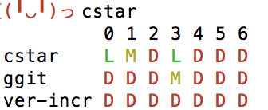

# cstar

最近頑張ってるプロジェクトを可視化しましょう！



## Description

これは結城浩先生([twitter](https://twitter.com/hyuki))が考案された[色付き星取表(ja)](https://note.mu/hyuki/n/n9a6e7c1e0d7b)をgitで実現するためのツールです。

## Usage

コマンドラインで使います。  
プロジェクトルートで `cstar` を実行してください。

```
$ cstar
```

cstarは配下の `.git` ディレクトリを探し、ログを日次で収集します。  
その結果から最近どのプロジェクトにどれくらい注力しているのかを確認することができます。

実行時の配下ではなく、ディレクトリを指定して実行することもできます。  
このとき複数指定することもできます。

```
$ cstar /path/to/dir/ /path/to/dir2/
```

### options

- `-d, --day`
  - 何日分表示するかの設定です。指定しない場合は7日になります。
  - 例: `cstar -d 5` あるいは `cstar /path/to/dir/ -d 5`

## Install

### Binary

Go言語を使ったことがない方は[cstarのバイナリをこちらからダウンロードして](https://github.com/hkdnet/cstar/releases) `$PATH` の通っているディレクトリに置いてください。

### Golang

Go言語を使ったことがある方は `go get` で取得してください。

```bash
$ go get -d github.com/hkdnet/cstar
```

## Contribution

1. Fork ([https://github.com/hkdnet/cstar/fork](https://github.com/hkdnet/cstar/fork))
1. Create a feature branch
1. Commit your changes
1. Rebase your local changes against the master branch
1. Run test suite with the `go test ./...` command and confirm that it passes
1. Run `gofmt -s`
1. Create a new Pull Request

## Author

[hkdnet](https://github.com/hkdnet)
